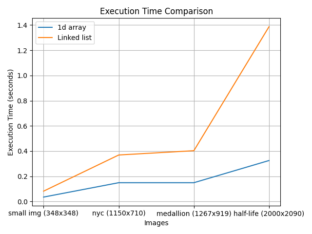

# rapport lab01

Lors de ce laboratiore, nous avons du appliquer des filtres a des images pour faire une detection de contours.

en voici les résultats:

### medallion
```bash
$ time ./lab01 ../images/medalion.png out_.png 1

real    0m0.149s
user    0m0.117s
sys     0m0.032s

$ time  ./lab01 ../images/medalion.png out_chained.png 2
start conversion

real    0m0.403s
user    0m0.319s
sys     0m0.083s
```

### half-life
```bash
$ time ./lab01 ../images/half-life.png out_.png 1

real    0m0.325s
user    0m0.294s
sys     0m0.031s
$ time ./lab01 ../images/half-life.png out_.png 2
start conversion

real    0m1.387s
user    0m1.028s
sys     0m0.359s
```

### nyc

```bash
$ time ./lab01 ../images/nyc.png out_.png 1

real    0m0.149s
user    0m0.137s
sys     0m0.013s
$ time ./lab01 ../images/nyc.png out_.png 2
start conversion

real    0m0.369s
user    0m0.317s
sys     0m0.052s
```

### small
```bash
$ time ./lab01 ../images/50x50.png out_.png 1


real    0m0.035s
user    0m0.025s
sys     0m0.011s
$ time ./lab01 ../images/50x50.png out_.png 2
start conversion

real    0m0.082s
user    0m0.066s
sys     0m0.016s
```



Nous voyons que la liste chainée ralentit le programme.

ceci est du au fait de devoir parcourir la liste chainée lors de l'application du filtre, dans notre programme nous essayons de minimiser le nombre de parcours de la liste chainée en utilisant des pointeurs judicieusement placés.

Mais neanmoins le parcours doit quand meme se faire et plus l'image est grande plus le temps de parcours est long.


```bash
$ time  ./lab01 ../images/medalion.png med_.png 1
width: 1267
height: 919

real    0m0.131s
user    0m0.089s
sys     0m0.042s

$ time  ./lab01 ../images/medalion.png med_chain.png 2
start conversion

real    0m19.137s
user    0m19.067s
sys     0m0.069s

$ time  ./lab01 ../images/half-life.png h.png 1
width: 2000
height: 2090

real    0m0.288s
user    0m0.258s
sys     0m0.030s

$ time  ./lab01 ../images/half-life.png hal_chain.png 2
start conversion

real    1m49.654s
user    1m49.343s
sys     0m0.300s

$ time  ./lab01 ../images/nyc.png ny.png 1
width: 1150
height: 710

real    0m0.106s
user    0m0.102s
sys     0m0.004s

$ time  ./lab01 ../images/nyc.png ny_chain.png 2
start conversion

real    0m11.807s
user    0m11.740s
sys     0m0.066s

$ time  ./lab01 ../images/50x50.png 50.png 1
width: 348
height: 348

real    0m0.040s
user    0m0.037s
sys     0m0.004s

$ time  ./lab01 ../images/50x50.png 50_chain.png 2
start conversion

real    0m0.573s
user    0m0.546s
sys     0m0.028s

```