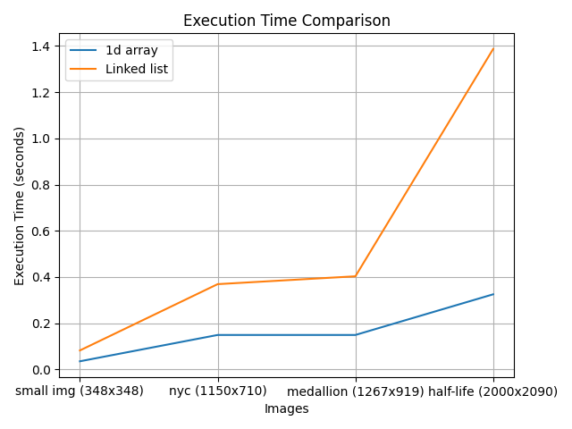

\topmargin = -30pt
\textheight = 625pt

\center

# **Laboratoire 1: Laboratoire d'introduction**

\hfill\break

\hfill\break

Département: **TIC**

Unité d'enseignement: **HPC**

\hfill\break

\hfill\break

\hfill\break

\hfill\break

\hfill\break

\hfill\break

\hfill\break

\hfill\break

\hfill\break

\raggedright

Auteur(s):

- **CECCHET Costantino**

Professeur:

- **DASSATI Alberto**
  
Assistant:

- **DA ROCHA CARVALHO Bruno**

Date:

- **28/02/2024**

\pagebreak

\hfill\break

\hfill\break

\center

*\[Page de mise en page, laissée vide par intention\]*

\raggedright

\pagebreak

## **Introduction**

Pour ce laboratoire d'introduction, nous avons du appliquer des filtres a des images pour faire une detection de contours de deux manières différentes, une fois en utilisant des tableaux et une autre fois en utilisant des listes chaînées.

La detection de contours consiste en 3 étapes:

1. **Conversion de l'image en niveaux de gris**

2. **Application du filtre de gaussien**

3. **Application du filtre de sobel**

Une fois cest 3 étapes réalisées, nous obtenons une image avec les contours détectés.

\hfill\break

## **Programme**

l’idée du programme utilisant un tableau est tres simple, nous avons une image en 2D, et nous appliquons les filtres sur chaque pixel de l'image.

Pour la liste chaînée en revanche, nous avons une liste de pixels qui pointent vers le pixel suivant, et nous appliquons les filtres sur chaque pixel de la liste.

Pour éviter de devoir parcourir toute l'image pour récupérer un pixel, j'ai utilisée un pixel de temporaire qui représente le pixel du kernel gaussien en bas à droite.

Ce pixel temporaire est mis a jour à chaque fois que nous avançons dans l'image, les bords de l'image sont ignorés.

## **Résultats**

Les résultats obtenus sont les suivants:

{ width=80% }

Nous pouvons voir que les deux méthodes sont très similaires, mais la méthode utilisant les listes chaînées est plus lente.

Ceci est du au fait que pour la méthode utilisant la liste chaînée, nous devons parcourir toute l'image pour récupérer un pixel, alors que pour la méthode utilisant un tableau, nous avons directement accès au pixel.

Nous voyons tres bien le ralentissement de la méthode utilisant les listes chaînées sur des images de tailles croissantes.

\hfill\break

## **Data récoltées**

Voici les données récoltées lors des tests:

```bash
$ time  ./lab01 ../images/medalion.png med_.png 1
width: 1267
height: 919

real    0m0.131s
user    0m0.089s
sys     0m0.042s

$ time  ./lab01 ../images/medalion.png med_chain.png 2
start conversion

real    0m19.137s
user    0m19.067s
sys     0m0.069s

$ time  ./lab01 ../images/half-life.png h.png 1
width: 2000
height: 2090

real    0m0.288s
user    0m0.258s
sys     0m0.030s

$ time  ./lab01 ../images/half-life.png hal_chain.png 2
start conversion

real    1m49.654s
user    1m49.343s
sys     0m0.300s

$ time  ./lab01 ../images/nyc.png ny.png 1
width: 1150
height: 710

real    0m0.106s
user    0m0.102s
sys     0m0.004s

$ time  ./lab01 ../images/nyc.png ny_chain.png 2
start conversion

real    0m11.807s
user    0m11.740s
sys     0m0.066s

$ time  ./lab01 ../images/small_img.png small_img.png 1
width: 348
height: 348

real    0m0.040s
user    0m0.037s
sys     0m0.004s

$ time  ./lab01 ../images/small_img.png small_img_chain.png 2
start conversion

real    0m0.573s
user    0m0.546s
sys     0m0.028s

```

## **Environnement d'execution**

Le système décrit dispose d'un processeur Intel Core i7-8550U avec 8 threads, répartis sur 4 cœurs physiques. La fréquence du processeur est de 1,80 GHz avec une fréquence mesurée de 1432,548 MHz. 

Voici plus ample information sur le processeur:

```bash
$ cat /proc/cpuinfo 
processor	: 0
vendor_id	: GenuineIntel
cpu family	: 6
model		: 142
model name	: Intel(R) Core(TM) i7-8550U CPU @ 1.80GHz
stepping	: 10
microcode	: 0xf4
cpu MHz		: 1432.548
cache size	: 8192 KB
physical id	: 0
siblings	: 8
core id		: 0
cpu cores	: 4
apicid		: 0
initial apicid	: 0
fpu		: yes
fpu_exception	: yes
cpuid level	: 22
wp		: yes
flags		: fpu vme de pse tsc msr pae mce cx8 apic sep mtrr pge mca cmov pat pse36 clflush dts acpi mmx fxsr sse sse2 ss ht tm pbe syscall nx pdpe1gb rdtscp lm constant_tsc art arch_perfmon pebs bts rep_good nopl xtopology nonstop_tsc cpuid aperfmperf pni pclmulqdq dtes64 monitor ds_cpl vmx est tm2 ssse3 sdbg fma cx16 xtpr pdcm pcid sse4_1 sse4_2 x2apic movbe popcnt tsc_deadline_timer aes xsave avx f16c rdrand lahf_lm abm 3dnowprefetch cpuid_fault epb invpcid_single pti ssbd ibrs ibpb stibp tpr_shadow vnmi flexpriority ept vpid ept_ad fsgsbase tsc_adjust sgx bmi1 avx2 smep bmi2 erms invpcid mpx rdseed adx smap clflushopt intel_pt xsaveopt xsavec xgetbv1 xsaves dtherm ida arat pln pts hwp hwp_notify hwp_act_window hwp_epp md_clear flush_l1d arch_capabilities
vmx flags	: vnmi preemption_timer invvpid ept_x_only ept_ad ept_1gb flexpriority tsc_offset vtpr mtf vapic ept vpid unrestricted_guest ple pml ept_mode_based_exec
bugs		: cpu_meltdown spectre_v1 spectre_v2 spec_store_bypass l1tf mds swapgs itlb_multihit srbds mmio_stale_data retbleed gds
bogomips	: 3999.93
clflush size	: 64
cache_alignment	: 64
address sizes	: 39 bits physical, 48 bits virtual
```