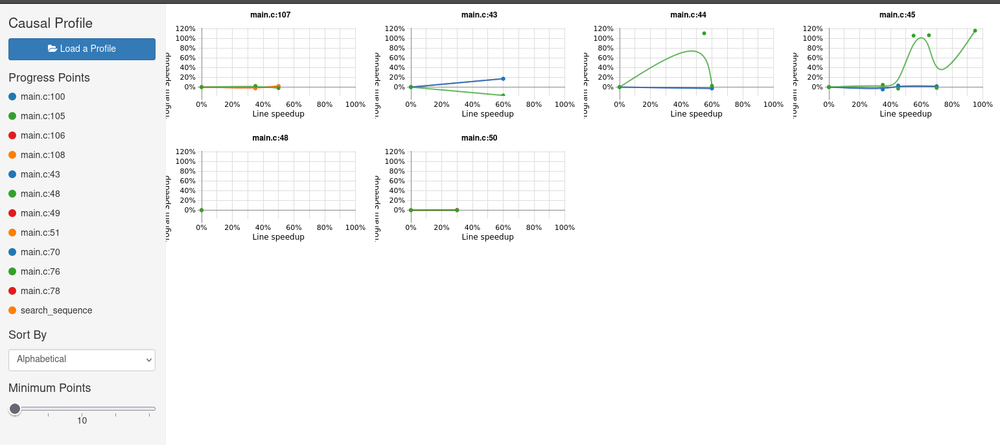

\topmargin = -30pt
\textheight = 625pt

\center

# **Laboratoire 7: coz-profiler**

\hfill\break

\hfill\break

Département: **TIC**

Unité d'enseignement: **HPC**

\hfill\break

\hfill\break

\hfill\break

\hfill\break

\hfill\break

\hfill\break

\hfill\break

\hfill\break

\hfill\break

\raggedright

Auteur(s):

- **CECCHET Costantino**

Professeur:

- **DASSATTI Alberto**
  
Assistant:

- **DA ROCHA CARVALHO Bruno**

Date:

- **28/02/2024**

\pagebreak

\hfill\break

\hfill\break

\center

*\[Page de mise en page, laissée vide par intention\]*

\raggedright

\pagebreak

## **Introduction**

Pour ce laboratoire, nous avons utilisé le profiler `coz-profiler` pour analyser le code fourni. Le code est un programme qui effectue la recherche d'un pattern de nombre a l'intérieur d'un fichier texte.

## **Analyse du code**

Le code de base fourni dans main.c lis chaque caractère du fichier texte et compare avec le pattern. Si le caractère est égal au premier caractère du pattern, alors on compare les caractères suivants. Si le pattern est trouvé, on termine la recherche et on affiche le résultat.

On peux profiler ca avec `coz-profiler` pour voir les performances du code.

Il faut ajouter des flags dans le code pour que le profiler puisse fonctionner correctement(COZ_PROGRESS, COZ_BEGIN, COZ_END).

On compile le code avec openMP et les flags pour le profiler:

```bash
$ gcc -g -gdwarf-3 -fopenmp main.c -o main
```

puis on lance le programme avec le profiler:

```bash
$ coz run ./main <input_file> <pattern>
```

Ici si le fichier fourni est trop petit on n'arrivera pas a voir les résultats du profiler ave COZ. On peut donc utiliser un fichier plus grand pour que le profiler puisse afficher des résultats. Ce dernier va afficher un graphique avec les résultats.

Une fois ceci effectué on peut utiliser le fichier **profile.coz** pour visualiser les résultats avec le profiler.

```bash 
$ coz display profile.coz
```

Si cette commande ne fonctionne pas, on peut utiliser le [**site web**](https://plasma-umass.org/coz/) de coz pour visualiser les résultats.



## **Analyse des résultats**

Grâce a ce graph nous voyons ou sont les problèmes de performance dans le code. On va donc pouvoir utiliser openMP pour optimiser ce code.

## **Optimisation du code**

On peux voir que dans la recherche du pattern, on peux travailler en parallèle. On va donc utiliser openMP pour paralléliser la recherche du pattern.

Nous allons dispatcher le fichier en plusieurs parties et chaque thread va chercher le pattern dans sa partie du fichier.

Chaque thread va chercher le pattern dans une partie du fichier et si le pattern est trouvé, on termine la recherche.

Le choix a été fait sur la boucle for car c'est ici que le code passe le plus de temps.

## **conclusion**

cette optimisation nous permet de gagner en performance et de réduire le temps d'exécution du programme.

Ce laboratoire nous a permis de voir comment utiliser le profiler `coz-profiler` pour analyser un code et trouver les problèmes de performance.


## **Environnement d'execution**

Le système décrit dispose d'un processeur Intel Core i7-8550U avec 8 threads, répartis sur 4 cœurs physiques. La fréquence du processeur est de 1,80 GHz avec une fréquence mesurée de 1432,548 MHz. 

Voici plus ample information sur le processeur:

```bash
$ cat /proc/cpuinfo 
processor	: 0
vendor_id	: GenuineIntel
cpu family	: 6
model		: 142
model name	: Intel(R) Core(TM) i7-8550U CPU @ 1.80GHz
stepping	: 10
microcode	: 0xf4
cpu MHz		: 1432.548
cache size	: 8192 KB
physical id	: 0
siblings	: 8
core id		: 0
cpu cores	: 4
apicid		: 0
initial apicid	: 0
fpu		: yes
fpu_exception	: yes
cpuid level	: 22
wp		: yes
flags		: fpu vme de pse tsc msr pae mce cx8 apic sep mtrr pge mca cmov pat pse36 clflush dts acpi mmx fxsr sse sse2 ss ht tm pbe syscall nx pdpe1gb rdtscp lm constant_tsc art arch_perfmon pebs bts rep_good nopl xtopology nonstop_tsc cpuid aperfmperf pni pclmulqdq dtes64 monitor ds_cpl vmx est tm2 ssse3 sdbg fma cx16 xtpr pdcm pcid sse4_1 sse4_2 x2apic movbe popcnt tsc_deadline_timer aes xsave avx f16c rdrand lahf_lm abm 3dnowprefetch cpuid_fault epb invpcid_single pti ssbd ibrs ibpb stibp tpr_shadow vnmi flexpriority ept vpid ept_ad fsgsbase tsc_adjust sgx bmi1 avx2 smep bmi2 erms invpcid mpx rdseed adx smap clflushopt intel_pt xsaveopt xsavec xgetbv1 xsaves dtherm ida arat pln pts hwp hwp_notify hwp_act_window hwp_epp md_clear flush_l1d arch_capabilities
vmx flags	: vnmi preemption_timer invvpid ept_x_only ept_ad ept_1gb flexpriority tsc_offset vtpr mtf vapic ept vpid unrestricted_guest ple pml ept_mode_based_exec
bugs		: cpu_meltdown spectre_v1 spectre_v2 spec_store_bypass l1tf mds swapgs itlb_multihit srbds mmio_stale_data retbleed gds
bogomips	: 3999.93
clflush size	: 64
cache_alignment	: 64
address sizes	: 39 bits physical, 48 bits virtual

$ likwid-topology 
--------------------------------------------------------------------------------
CPU name:	Intel(R) Core(TM) i7-8550U CPU @ 1.80GHz
CPU type:	Intel Kabylake processor
CPU stepping:	10
********************************************************************************
Hardware Thread Topology
********************************************************************************
Sockets:		1
Cores per socket:	4
Threads per core:	2
--------------------------------------------------------------------------------
HWThread	Thread		Core		Socket		Available
0		0		0		0		*
1		0		1		0		*
2		0		2		0		*
3		0		3		0		*
4		1		0		0		*
5		1		1		0		*
6		1		2		0		*
7		1		3		0		*
--------------------------------------------------------------------------------
Socket 0:		( 0 4 1 5 2 6 3 7 )
--------------------------------------------------------------------------------
********************************************************************************
Cache Topology
********************************************************************************
Level:			1
Size:			32 kB
Cache groups:		( 0 4 ) ( 1 5 ) ( 2 6 ) ( 3 7 )
--------------------------------------------------------------------------------
Level:			2
Size:			256 kB
Cache groups:		( 0 4 ) ( 1 5 ) ( 2 6 ) ( 3 7 )
--------------------------------------------------------------------------------
Level:			3
Size:			8 MB
Cache groups:		( 0 4 1 5 2 6 3 7 )
--------------------------------------------------------------------------------
********************************************************************************
NUMA Topology
********************************************************************************
NUMA domains:		1
--------------------------------------------------------------------------------
Domain:			0
Processors:		( 0 4 1 5 2 6 3 7 )
Distances:		10
Free memory:		542.145 MB
Total memory:		7695.82 MB
--------------------------------------------------------------------------------

```