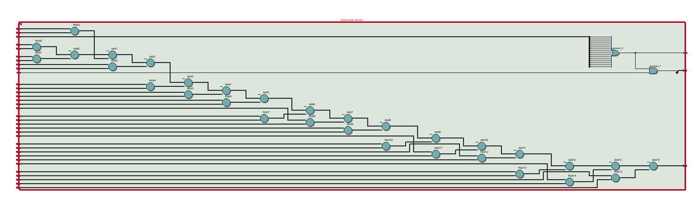
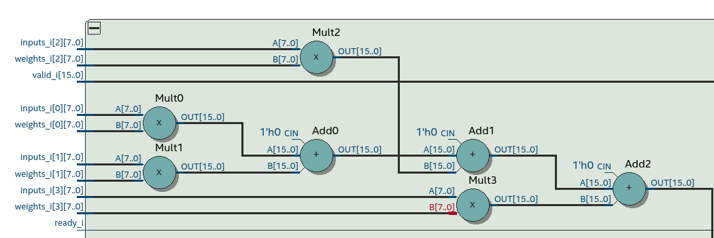
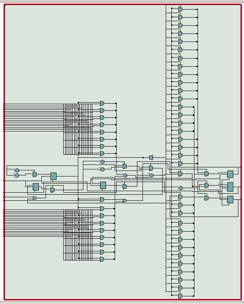
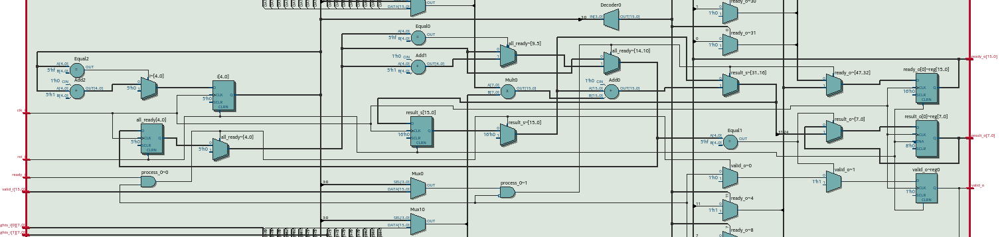
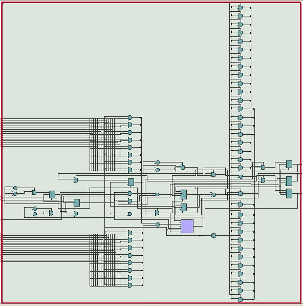
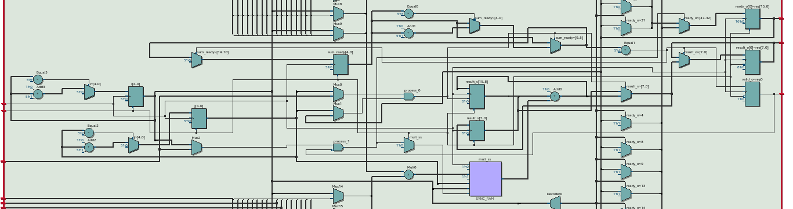

\topmargin = -30pt
\textheight = 625pt

\center

# **Laboratoire 7: Neurone en vhdl**

\hfill\break

\hfill\break

Département: **TIC**

Unité d'enseignement: **SCF**

\hfill\break

\hfill\break

\hfill\break

\hfill\break

\hfill\break

\hfill\break

\hfill\break

\hfill\break

\raggedright

Auteur(s):

- **CECCHET Costantino**

Professeur:

- **DASSATTI Alberto**
- **YANN Thomas**
  
Assistant:

- **JACCARD Anthony I.**

Date:

- **01/03/2024**

\pagebreak

\hfill\break

\hfill\break

\center

*\[Page de mise en page, laissée vide par intention\]*

\raggedright

\pagebreak

## **Introduction**

Lors de ce laboratoire il a été demandé de réaliser un neurone en VHDL de 3 manières différentes, de façon combinatoire, séquentielle et pipelinant l'addition et la multiplication. Le but de ce laboratoire est de comprendre le fonctionnement d'un neurone et de le réaliser en VHDL.

\hfill\break

## **Partie 1: Multiplication de vecteurs et report de la virgule**

lors de la multiplication de nombre a virgule en binaire, il est nécessaire de décaler le résultat pour que la virgule soit bien placée. Pour cela voici un exemple de multiplication de 2 vecteurs de 4 bits avec une virgule de 2 bits.

|1,5| 1,5| 2,25|
|---|----|-----|
|01,10|01,10|00100100|

pour savoir ou va la virgule il faut tout d'abord tronquer notre résultat pour qu'il fasse la taille de nos vecteurs, ici 4 bits. Ensuite on regarde combien de bits sont avant la virgule, ici 2 bits. On décale donc notre virgule de 2 bits pour que le résultat soit correct, la troncation s'effectue en enlevant les bits de poids faible et fort par rapport a la place de la virgule.

dans notre cas **00**1001**00** devient **1001**, puis la virgule est décalée de 2 bits pour donner **10,**01 ce qui nous donne bien 2,25.

\hfill\break

## **Partie 2: Réalisation d'un neurone en VHDL combinatoire**

Grâce à l'entité neuron fournie, on peux tout simplement parcourir les inputs et les weights pour les multiplier et les additionner. On obtient donc un neurone combinatoire.

en voici le schéma généré par le logiciel de synthèse.





dans ces 2 images on voit bien les additionneurs et les multiplieurs qui sont utilisés pour réaliser le neurone on voit la cascade d'operations qui sont effectuées pour obtenir le résultat final, et le valid_o qui est activé lorsque le résultat est prêt.

\hfill\break

## **Partie 3: Réalisation d'un neurone en VHDL séquentiel**

Pour cette partie il a été demandé de réaliser un neurone en VHDL séquentiel, pour cela on a utilisé un processus qui est déclenché par un signal de validation. On a donc un signal de validation qui est activé lorsque les inputs et les poids sont prêts, le processus est pour chaque entrée individuellement du moment que le signal de validation est activé.

La sortie est donc mise à jour à chaque fois que le signal de validation est activé, mais n'est disponible que lorsque le signal de valid_o est activé, c'est à dire quand tout les neurones ont été calculés.

en voici le schéma généré par le logiciel de synthèse.





Dans cette dernière image on voit bien que la multiplication et l'addition sont effectuées les une apres les autres(__add0__), et que le valid_o est activé lorsque tout les neurones ont été calculés.

Ceci nous permet de réduire le temps de calcul, car des que le signal de validation est activé, le neurone est calculé, et le signal de valid_o est activé lorsque tout les neurones ont été calculés et on ne doit pas attendre que tout les neurones soient validées pour calculer le suivant.

\hfill\break

## **Partie 4: Réalisation d'un neurone en VHDL pipeliné**

Pour cette partie il a été demandé de réaliser un neurone en VHDL pipeliné, principalement de séparer l'addition et la multiplication en 2 processus différents. On a donc un processus pour l'addition et un processus pour la multiplication, et un signal de validation pour chaque processus.

L'addition est faite lors ce que chaque multiplication a été validée, et la multiplication quand le neurone nous informe que ses donnée en entrée sont valides.

Ceci est bien montrer sur le schéma de synthèse.





dans ce cas spécifique il est dur de montrer l’intégralité du schéma, mais on arrive a voir que l'addition et la multiplication sont séparées, et que le valid_o est activé lorsque tout les neurones ont été calculés.

\hfill\break

## **Comparaison des 3 neurones**

|type|#logique|#registres|
|---|---|---|
|combinatoire|12|26|
|séquentiel|166|354|
|pipeliné|168|372|

Ceci nous montre bien que le nombre de logique et de registres est plus important pour le neurone séquentiel et pipeliné que pour le combinatoire, ceci est du au fait que le séquentiel et le pipeliné doivent garder en mémoire les valeurs des neurones précédents pour les additionner, alors que le combinatoire n'a pas besoin de garder en mémoire les valeurs précédentes.

Mais en terme de temps de calcul, le séquentiel et le pipeliné sont plus rapide que le combinatoire, car ils calculent les neurones un par un, alors que le combinatoire doit attendre que tout les neurones soient calculés pour donner un résultat.


## **Problèmes rencontrés**

Lors des simulations des neurones, une erreur est présente dans les 3 cas.

```bash
# ** Error: [ERROR] @ 3400000 ns No more heart beat. The system seems down
#    Time: 3400 us  Iteration: 0  Instance: /neuron_tb/monitor
```

Ayant discuter avec mes collègues, je n'ai pas trouver de solution à ce problème. Néanmoins, les neurones semblent fonctionner correctement, et les résultats sont corrects pour les test qu'il effectue.

\hfill\break

## **Conclusion**

Ce laboratoire m'a permis de voir les différentes façons de réaliser un élément en VHDL, nous voyons la difference de materiel utiliser par chaque approche et nous constatons les difference causées par ces choix en temps de calcul.